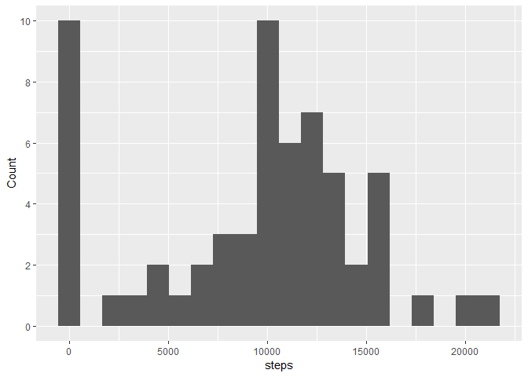
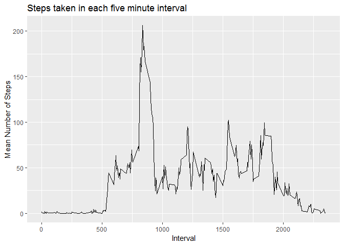
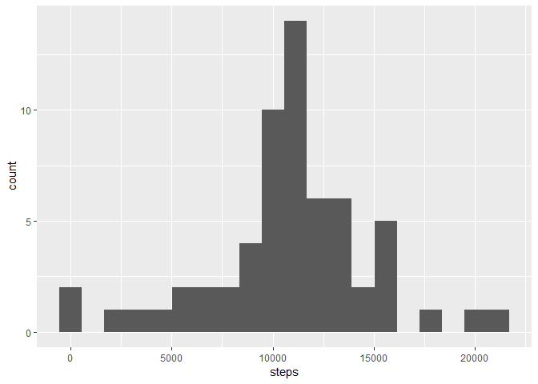
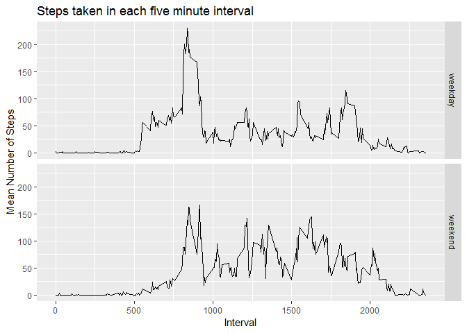

## Loading and preprocessing the data

We first load the required packages

```r
require(tidyverse)
require(lubridate)
```

1. Then we read the data into R, downloading it if it does not already exist


```r
if(!file.exists("activity.csv"))
{
  if(!file.exists("activity.zip"))
  {
    download.file(url="https://d396qusza40orc.cloudfront.net/repdata%2Fdata%2Factivity.zip",
                  destfile="activity.zip")
  }
  unzip("activity.zip")
}
actdata<-read.csv("activity.csv")
```
2. We convert the `date` variable to date format using `ymd`

```r
actdata<-mutate(actdata,date=ymd(date))
```


## What is mean total number of steps taken per day?

1. We first group the data by date, and then obtain the total number of steps for each day.

```r
totalsteps<- 
  actdata %>%
  group_by(date) %>%
  summarise(steps=sum(steps,na.rm=TRUE))
```

We then construct a histogram

```r
plot1<-
  ggplot(data=totalsteps, aes(steps)) + 
  geom_histogram(bins=20)+
  scale_y_continuous(name="Count",breaks=2*(0:5))
```
<!-- -->

2. We then calulate the mean and median numbers of daily steps

```r
mean(totalsteps$steps,na.rm=TRUE)
```

```
## [1] 9354.23
```

```r
median(totalsteps$steps,na.rm=TRUE)
```

```
## [1] 10395
```


## What is the average daily activity pattern?

1. We first group the original data by `interval` and then obtain the mean number of steps per interval across all days.

```r
byinterval <-actdata %>%
          group_by(interval) %>%
          summarise(mean.steps = mean(steps,na.rm=TRUE))
```
Using this data, we construct a time-series plot.

```r
plot2<-ggplot(data=byinterval,aes(x=interval,y=mean.steps)) +
  geom_line()+
  labs(title="Steps taken in each five minute interval",x="Interval",y="Mean Number of Steps")
```
<!-- -->


2. To obtain the interval corresponding to the largest number of steps, we run the following command:

```r
byinterval$interval[which.max(byinterval$mean.steps)]
```

```
## [1] 835
```


## Imputing missing values

1. The number of days/intervals for which the number of steps is missing can be found using the following command:

```r
sum(is.na(actdata$steps))
```

```
## [1] 2304
```

2.  We are going to fill the missing values by replacing each of them with the mean number of steps for the corresponding interval, averaged across all days for which values exist.  We first construct a new table `filldata` (shown below) which calculates the mean number of steps for each interval.


```r
filldata<- actdata %>%
  group_by(interval) %>%
  summarise(interval.mean.steps=mean(steps,na.rm=TRUE))
```


```
## # A tibble: 288 x 2
##    interval interval.mean.steps
##       <int>               <dbl>
##  1        0              1.72  
##  2        5              0.340 
##  3       10              0.132 
##  4       15              0.151 
##  5       20              0.0755
##  6       25              2.09  
##  7       30              0.528 
##  8       35              0.868 
##  9       40              0     
## 10       45              1.47  
## # ... with 278 more rows
```

3.  To fill in the missing data, we first merge `filldata` with `actdata` by `interval`:


```r
actdata<- as.tbl(left_join(actdata,filldata,by="interval"))
```

Finally, we fill in the missing values for number of steps by creating a new variable, `filled.steps`, given by

+ `steps`, if this value was not missing to bein with, or

+ `interval.mean.steps`, if the value was missing


```r
actdata<-mutate(actdata,filledsteps=ifelse(is.na(steps),interval.mean.steps,steps))
```

Below we give a random selection of 15 rows from this new table:

```r
sample_n(actdata,15)
```

```
## # A tibble: 15 x 5
##    steps date       interval interval.mean.steps filledsteps
##    <int> <date>        <int>               <dbl>       <dbl>
##  1     0 2012-11-11     2110             23.5              0
##  2     0 2012-11-16      850            183.               0
##  3     0 2012-11-22      435              0.660            0
##  4    32 2012-10-13      710             50.5             32
##  5    46 2012-11-02      955             21.1             46
##  6     0 2012-11-26        0              1.72             0
##  7     0 2012-10-26     1535             65.3              0
##  8     0 2012-10-26      345              0.0755           0
##  9     0 2012-10-19      840            196.               0
## 10     0 2012-10-18     1010             42.4              0
## 11     0 2012-10-27     1100             31.4              0
## 12    18 2012-11-25     2205              3.68            18
## 13     0 2012-10-30     1600             62.1              0
## 14     0 2012-10-31     2335              4.70             0
## 15     0 2012-11-07      145              0.377            0
```

4. We now construct a histogram using the filled data as before:


```r
totalfilledsteps<- actdata %>%
            group_by(date) %>%
  summarise(steps=sum(filledsteps,na.rm=TRUE))

plot3<-ggplot(data=totalfilledsteps, aes(steps)) + 
      geom_histogram(bins=20)
```

<!-- -->

Note that the number of days for which a very small number of steps were recorded has decreased significantly.  The mean and median have also changed.


```r
mean(totalfilledsteps$steps)
```

```
## [1] 10766.19
```

```r
median(totalfilledsteps$steps)
```

```
## [1] 10766.19
```


## Are there differences in activity patterns between weekdays and weekends?

1. We first create a new factor variable `wend` which determines whether or not the day in question is a weekday or a weekend


```r
actdata <- actdata %>% 
  mutate(dayofweek=weekdays(date)) %>%
  mutate(wend = ifelse
            (dayofweek=="Saturday"|dayofweek=="Sunday",
              "weekend",
              "weekday"
            )
         ) %>%
  mutate(wend=factor(wend))
```

We then group the data by both `interval` and `wend` and calculate the mean number of steps for each interval during both weekdays and weekends.  Note that here we are using the filled-in missing values.


```r
byintervalweekdays <-actdata %>%
          group_by(interval,wend) %>%
          summarise(mean.steps = mean(filledsteps))
byintervalweekdays
```

```
## # A tibble: 576 x 3
## # Groups:   interval [?]
##    interval wend    mean.steps
##       <int> <fct>        <dbl>
##  1        0 weekday    2.25   
##  2        0 weekend    0.215  
##  3        5 weekday    0.445  
##  4        5 weekend    0.0425 
##  5       10 weekday    0.173  
##  6       10 weekend    0.0165 
##  7       15 weekday    0.198  
##  8       15 weekend    0.0189 
##  9       20 weekday    0.0990 
## 10       20 weekend    0.00943
## # ... with 566 more rows
```

Finally we plot the activity patterns for weekdays and weekends.


```r
plot4<-ggplot(data=byintervalweekdays,aes(x=interval,y=mean.steps)) +
  geom_line()+
  facet_grid(wend~.)+
  labs(title="Steps taken in each five minute interval",x="Interval",y="Mean Number of Steps")
```

<!-- -->
